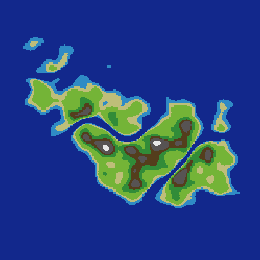
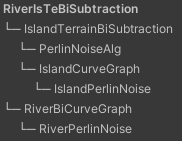
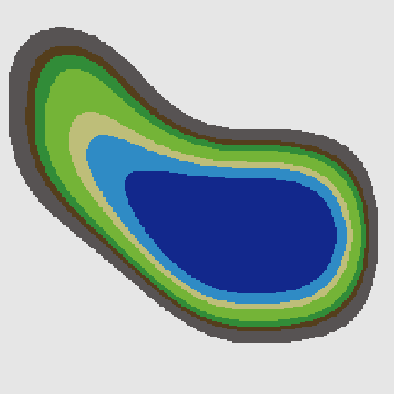
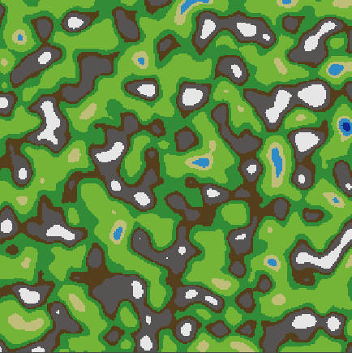
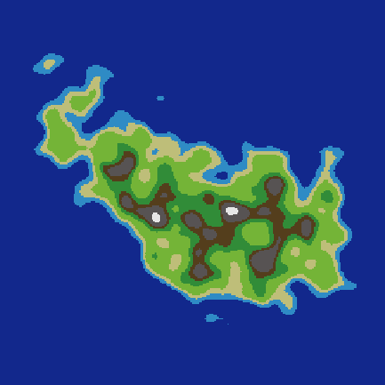
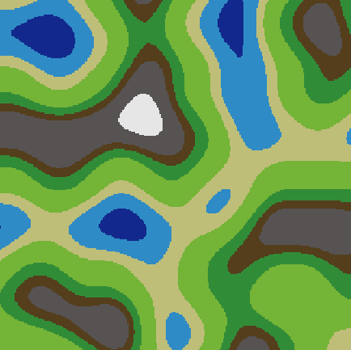
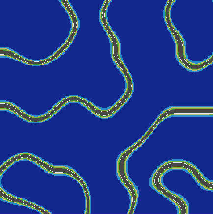
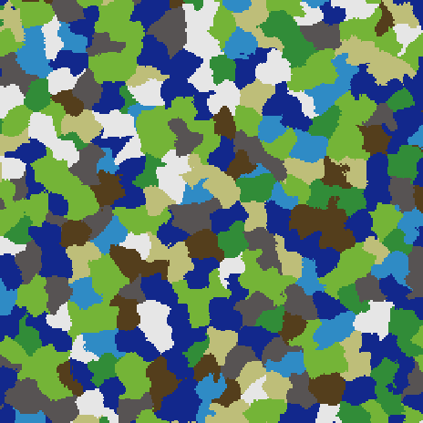
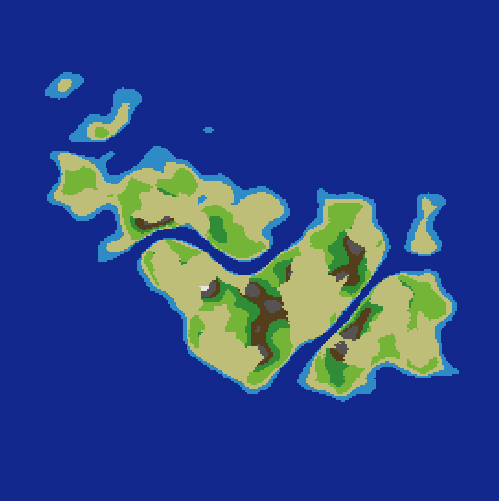

# Unity-2D-WorldGen
a procedural, tile-based 2D world generation in Unity Engine. Including additional features such as a* pathfinding

## Demo

### Generation Tree
generation tree view created by generation tree window:

- RiverIsTeBiSubtraction
  - IslandTerrainBiSubtraction
    - PerlinNoise
    - IslandCurveGraph
      - IslandPerlinNoise
  - RiverBiCurveGraph
    - RiverPerlinNoise

The generation tree shows the mathematical dependencies,
e.g. to create a ``RiverBiCurveGraph``, we first need to calculate ``RiverPerlinNoise``

### Island Perlin Noise

### Island Curve Graph

### Perlin Noise

### IslandTerrainBiSubtraction

### RiverPerlinNoise

### RiverBiCurveGraph
also known as perlin worms

### RiverIsTeBiSubtraction

### Voronoi Biomes

### Basic Desert Biome

